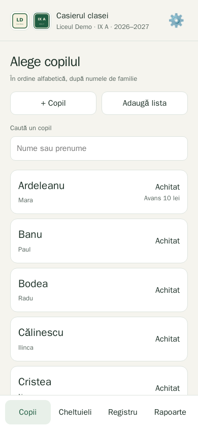
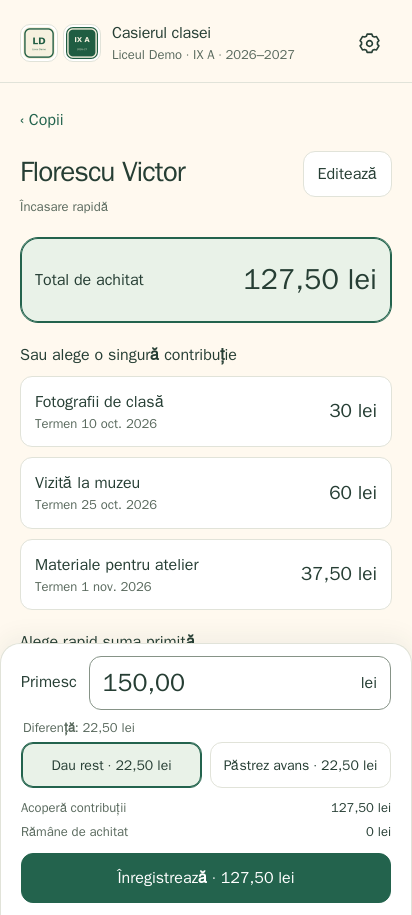
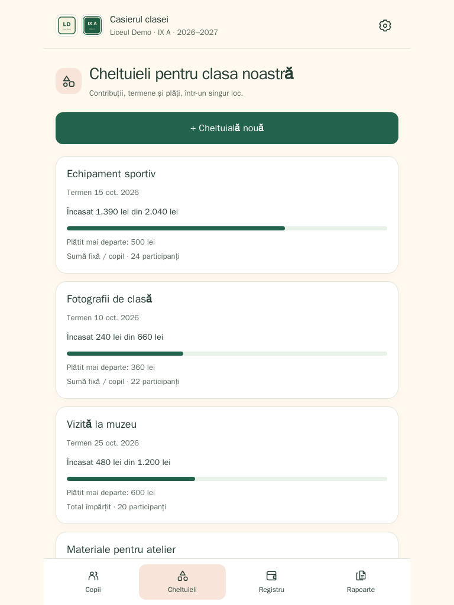
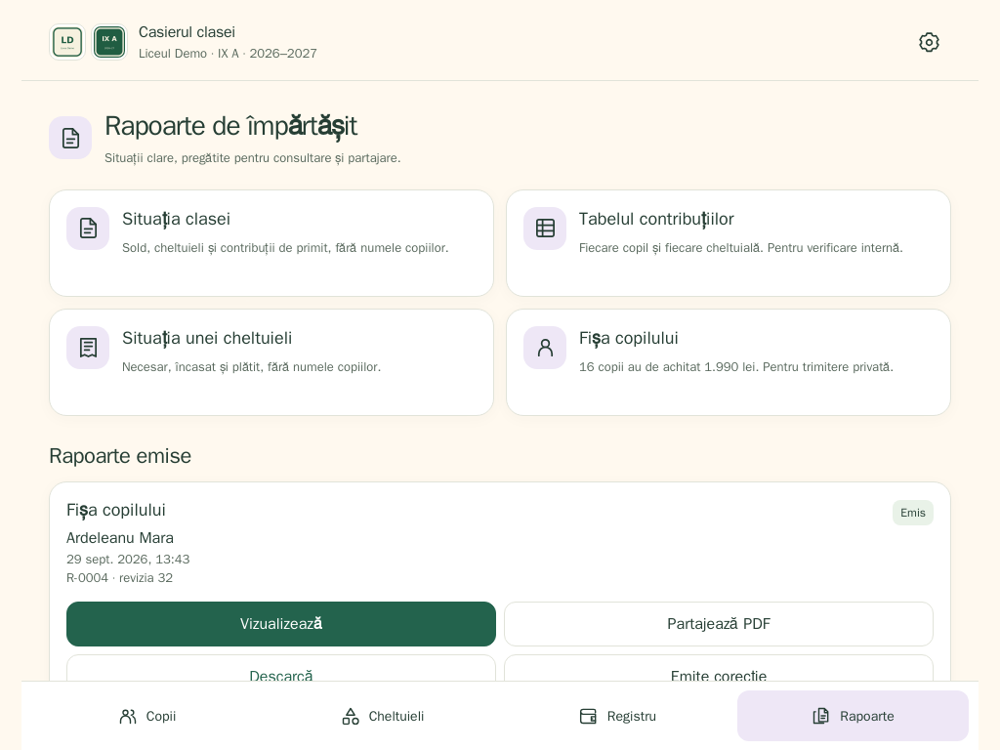
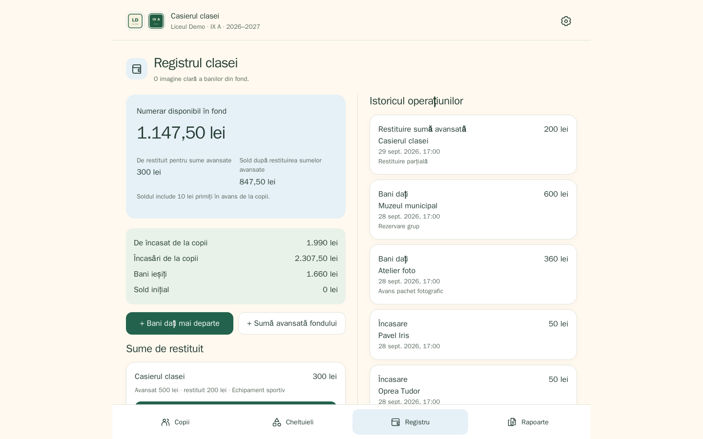
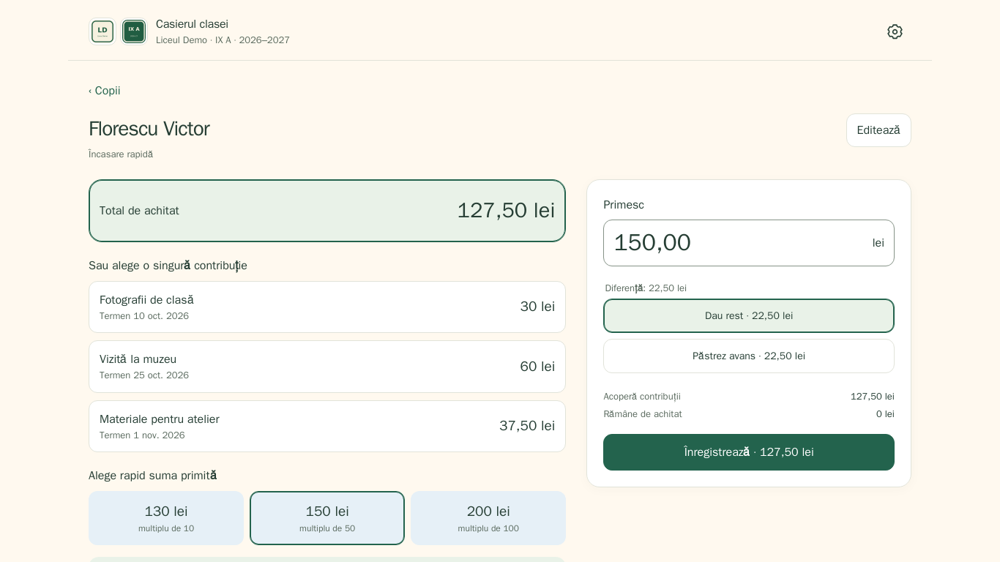
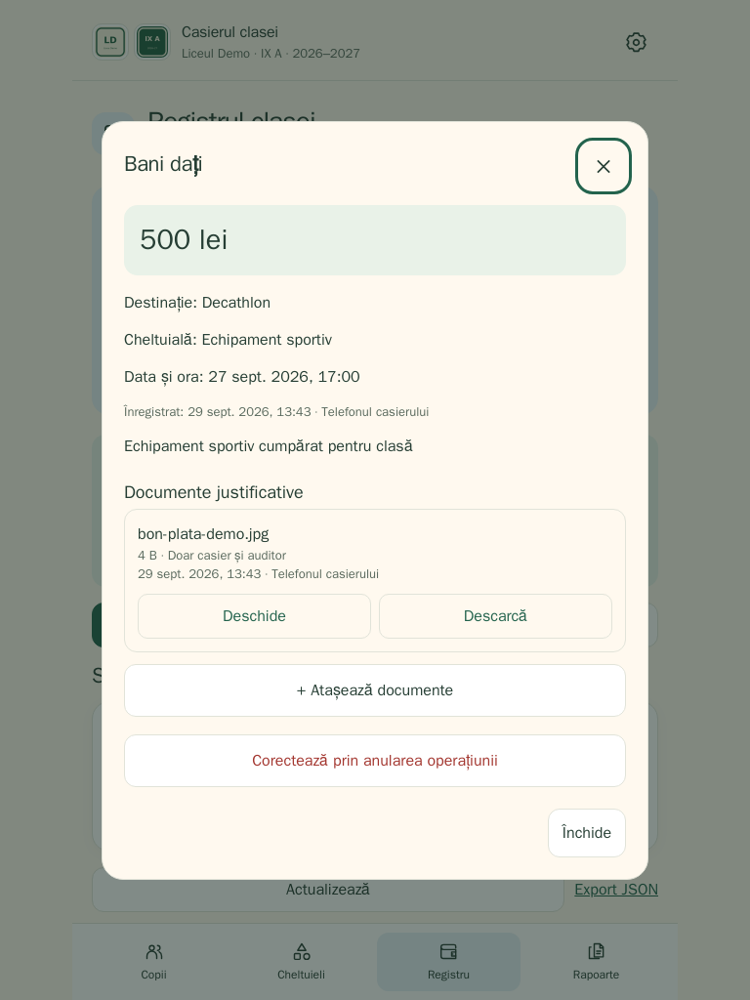
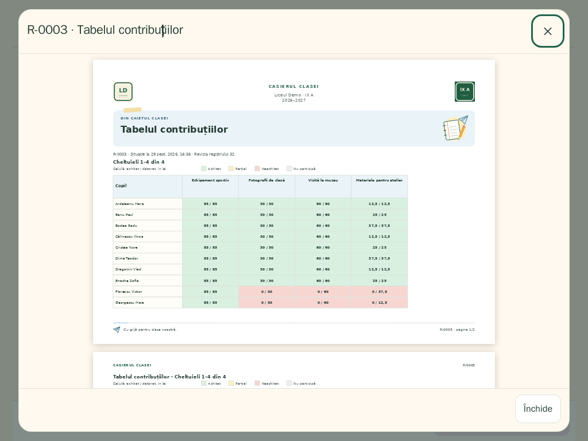
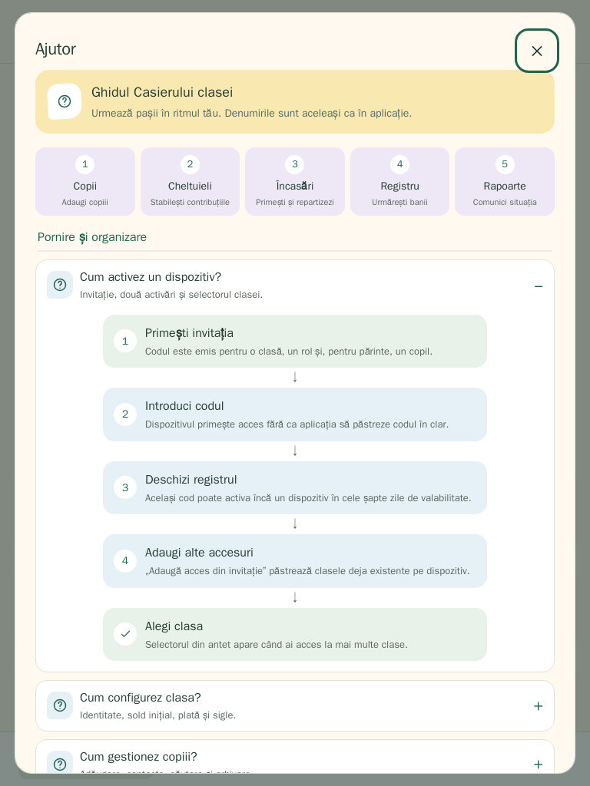

# Casierul clasei

PWA pentru evidența fondurilor mai multor clase și școli. Interfață în română, sume în lei, date persistente pe server în SQLite.

O atmosferă de comunitate școlară, cu ilustrații discrete, culori calde și situații de plată explicate pe înțelesul tuturor. Pe telefon, încasarea rămâne la îndemână. Pe tabletă, listele folosesc coloane; pe laptop, navigarea se mută lateral, iar registrul așază soldul și istoricul alături. Încasarea și situația copilului folosesc spațiul disponibil pentru a afișa informațiile în paralel.

Aplicația: https://casierul-clasei.zandaulion.com

## In English

**Casierul clasei** (“the class treasurer”) is a self-hosted progressive web app for keeping the money of a school class in order: which child owes what for each expense, what was collected, what was paid out, who advanced money to the fund and what is left. It is built for Romanian schools — the interface, PDF reports and WhatsApp reminders are in Romanian and amounts are in lei — but the server, tests and deployment files are documented in English.

- One Node.js process, one SQLite file per classroom, no external services; PDF reports rendered on the server, no CDN assets in the app.
- Three roles by invitation code: cashier (full access), parent (read-only, sees only their own child) and auditor (read-only, whole ledger).
- Financial history is append-only; corrections are new records. Every write is idempotent and protected against concurrent edits from a second device.

Quick start with Docker (behind an HTTPS reverse proxy such as Caddy or Cloudflare Tunnel):

```
printf 'PUBLIC_BASE_URL=https://casierul.example.com\nADMIN_TOKEN=%s\n' "$(openssl rand -hex 32)" > .env
chmod 600 .env
docker compose up -d
docker compose exec app node scripts/admin.mjs invite "My phone"   # prints the first cashier invitation
```

Keep `.env` private. Before an upgrade, create a validated SQLite backup and copy it outside the Docker volume as described in [the operations guide](docs/operations.md).

Without Docker: Node.js 24+, `npm ci`, `npm start`, then `node scripts/admin.mjs invite`. Configuration is through environment variables (`PUBLIC_BASE_URL`, `ADMIN_TOKEN`, `DATA_DIR`, `PORT`, `COOKIE_SECURE`); `deploy.sh` installs a systemd user service from the current checkout with daily backups. See [docs/operations.md](docs/operations.md), [docs/api.md](docs/api.md), [CONTRIBUTING.md](CONTRIBUTING.md) and [SECURITY.md](SECURITY.md).

## Capturi de ecran

Datele afișate în capturi sunt integral sintetice. Setul surprinde și contactele WhatsApp, detaliile de plată, totalul de achitat din Tabelul contribuțiilor, istoricul Registrului cu operațiunile recente primele și Ajutorul vizual integrat.

<table>
  <tr>
    <td align="center"><br><strong>Lista copiilor · 390×844</strong></td>
    <td align="center"><br><strong>Încasare rapidă · 412×915</strong></td>
  </tr>
</table>

<table>
  <tr>
    <td align="center"><br><strong>Cheltuieli · 768×1024</strong></td>
    <td align="center"><br><strong>Detalii de plată și rapoarte · 1024×768</strong></td>
  </tr>
</table>

<p align="center">
  <br>
  <strong>Registru în ordine descrescătoare · 1440×900</strong>
</p>

<p align="center">
  <br>
  <strong>Încasare pe laptop · 1366×768</strong>
</p>

<table>
  <tr>
    <td align="center"><br><strong>Documente justificative · 768×1024</strong></td>
    <td align="center"><br><strong>Tabelul contribuțiilor în PDF · 1024×768</strong></td>
  </tr>
</table>

<p align="center">
  <br>
  <strong>Ajutor general și contextual · 768×1024</strong>
</p>

## Începe

1. Generează o invitație cu `node scripts/admin.mjs invite` sau din [consola de invitații](https://github.com/zandaulion/pwa-invite-console) și activează telefonul. Același cod poate activa și un al doilea dispozitiv, de exemplu laptopul, în cele șapte zile de valabilitate.
2. Configurează școala, clasa, anul școlar și eventualul sold inițial.
3. Din **Copiii clasei → Gestionează copiii**, adaugă copiii individual sau lipește lista, câte un `Nume de familie; Prenume` pe linie.
4. Creează cheltuielile și selectează participanții: sumă fixă/copil, total împărțit sau cantitate/copil × preț unitar.

Pentru remindere, deschide un copil și salvează unul sau două contacte WhatsApp. Lista copiilor arată pentru casier dacă fiecare copil are zero, unul sau două numere configurate. Butonul contactului deschide conversația directă cu situația copilului completată; mesajul rămâne sub controlul tău și se trimite numai după confirmarea din WhatsApp. După generarea fișei individuale poți alege explicit **Doar mesajul** sau **Copiază mesajul + PDF**. La a doua variantă, aplicația pune textul în clipboard înainte de a deschide selectorul cu PDF-ul, deoarece WhatsApp pentru Android poate omite textul primit împreună cu un fișier; îl poți lipi imediat în conversație. Din lista copiilor, **Remindere WhatsApp** grupează toți copiii activi care au sume de achitat și arată contactele lipsă.

La o cheltuială împărțită, poți exclude copiii care nu participă până la prima contribuție încasată. Totalul rămâne neschimbat, iar aplicația recalculează automat partea fiecărui copil, inclusiv dacă plata furnizorului sau un avans temporar au fost deja înregistrate. Din fișa copilului, **Nu mai colectez** oferă direct această alegere atunci când recalcularea este încă posibilă.

Invitațiile pot acorda trei tipuri de acces. **Casierul** vede și modifică întregul registru. **Părintele** are acces doar pentru citire la situația generală și la datele copilului asociat, fără numele sau tranzacțiile celorlalți copii. **Auditorul** vede registrul complet și rapoartele, dar nu poate modifica sau exporta datele brute. Accesul doar pentru citire poate expira automat la data aleasă în consola PWA.

Cele două activări acordă același rol, aceeași clasă și aceeași dată de expirare a accesului; pentru părinte, se păstrează și copilul asociat. Fiecare dispozitiv are propria sesiune și poate fi revocat separat. Un alt browser sau profil, chiar pe același telefon ori laptop, folosește o activare separată. Codurile deja consumate înainte de introducerea limitei de două activări rămân închise; pentru al doilea dispozitiv se emite o invitație nouă.

Părintele cu un singur copil asociat ajunge direct la situația lui: contribuții, termene, avansuri și rapoarte disponibile.

Proprietarul poate adăuga alte clase din setări. Fiecare clasă are bază de date, copii, cheltuieli, rapoarte, sigle și drepturi proprii. Selectorul din antet apare când dispozitivul are acces la mai multe clase. Invitațiile se emit pentru o singură clasă și un singur rol; pentru părinte se alege și copilul. **Adaugă acces din invitație** păstrează accesurile existente, astfel încât același dispozitiv poate avea roluri diferite în clase diferite. Pașii compleți sunt în [ghidul pentru mai multe clase și drepturi](docs/multiple-classrooms.md).

## Încasare rapidă

Atinge copilul din lista alfabetică, apoi alege totalul de achitat sau o singură cheltuială. Totalul și rotunjirea apar primele, înaintea contribuțiilor individuale; contactele WhatsApp și partajarea raportului sunt mai jos, după formularul de încasare. Butoanele mari rotunjesc în sus la multiplu de 5, 10, 50 sau 100 lei, pornind mereu de la suma selectată. Un multiplu exact rămâne neschimbat.

Dacă părintele a dat banii direct doamnei diriginte, fotografului sau altui beneficiar, folosește **Înregistrează plata directă** din fișa copilului. Alegi contribuția, suma și beneficiarul; contribuția se stinge integral sau parțial, operațiunea apare separat în registru și rapoarte, iar numerarul clasei nu se modifică.

Pentru diferență, alege **Dau rest** sau **Păstrez în avans**. Dacă ai selectat o singură cheltuială, diferența nu se repartizează automat către alte datorii. Poți introduce suma primită și repartizarea manual. Rezumatul de lângă salvare arată suma primită, restul și suma înregistrată. Verifică-l și salvează; aplicația revine la lista copiilor și confirmă încasarea pentru copilul ales.

Dacă după o încasare rămâne cel mult 1 leu pentru totalul sau contribuția selectată, poți lăsa diferența de achitat, o poți acoperi din avansul existent al copilului sau o poți închide ca **ajustare de rotunjire**. Numerarul se înregistrează întotdeauna exact. Folosirea avansului și ajustarea sunt operațiuni distincte, reversibile și vizibile în istoric și rapoarte; ajustarea nu mărește soldul de numerar și apare separat de suma încasată.

Pentru o contribuție care nu va mai fi colectată, **Nu mai colectez** poate folosi integral sau parțial o sumă avansată personal fondului. Operațiunea apare drept **Acoperire din fond**: copilul nu este prezentat ca și cum părintele ar fi plătit, datoria fondului față de persoana care a avansat banii scade, iar numerarul nu se modifică. Dacă după o încasare parțială rămâne cel mult 1 leu, același meniu poate închide restul ca **Ajustare de rotunjire**, inclusiv după ce încasarea a fost deja salvată. Ambele operațiuni rămân distincte în registru și se pot corecta prin anulare, cu istoricul păstrat.

Pe tabletă în mod peisaj și pe laptop, contribuțiile și confirmarea încasării apar alături. Panoul de confirmare rămâne la îndemână în timpul derulării; pe telefon, el stă la baza ecranului. Rotirea sau redimensionarea ferestrei păstrează suma introdusă, contribuția selectată și repartizarea manuală.

Avansul poate acoperi ulterior alte contribuții sau poate fi restituit. Când copilul are simultan o sumă de achitat și un avans, butonul **Folosește avansul copilului** apare chiar în confirmarea încasării: avansul disponibil se scade din suma cerută în numerar, iar ambele repartizări se salvează împreună. Dacă avansul acoperă integral suma selectată, operațiunea se salvează fără o nouă încasare. Folosirea avansului nu înregistrează încă o intrare de bani.

## Evidență

- **Copii:** contribuții, restanțe, avansuri și istoricul fiecărui copil.
- **Remindere WhatsApp:** până la două contacte numite pentru fiecare copil și deschiderea conversației directe cu un mesaj privat precompletat. După emiterea fișei individuale, poți partaja doar mesajul sau copia mesajul și partaja PDF-ul; copierea oferă o soluție sigură când WhatsApp ignoră textul asociat fișierului. Selectorul sistemului nu permite aplicației să aleagă automat conversația. Aplicația nu trimite automat și nu marchează mesajul ca livrat.
- **Detalii de plată:** linkul Revolut.me, numele beneficiarului și IBAN-ul se păstrează în setările clasei. În Rapoarte, fiecare informație poate fi copiată sau deschisă separat în WhatsApp; mesajul Revolut precizează că plata se poate face și cu cardul fără cont Revolut și include indicația de a folosi numele elevului la detaliile plății. Aceleași informații apar în fișa individuală, situația clasei și raportul unei cheltuieli, precum și în reminderul WhatsApp individual; Tabelul contribuțiilor rămâne concentrat pe verificarea internă.
- **Cheltuieli:** participanți, contribuții calculate, termen, sume încasate și plătite. După o plată asociată, cardul și detaliul cheltuielii arată separat cât s-a strâns în fond după cea mai recentă plată, plățile directe ulterioare și cât mai este de colectat. O cheltuială poate fi editată; suma, calculul și participanții se blochează cât timp are operațiuni financiare active, iar denumirea, datele și comentariile rămân editabile. Pentru calculul pe cantități, cantitatea unui participant existent poate fi corectată dacă noua contribuție nu scade sub suma deja achitată.
- **Registru:** numerar disponibil, încasări, plăți directe către beneficiari, bani dați, restituiri, corecții și sume avansate temporar fondului. Istoricul este ordonat descrescător după data operațiunii, cu cele mai recente înregistrări primele. O sumă plătită personal poate fi asociată unei cheltuieli, restituită parțial sau integral ori folosită pentru a acoperi o contribuție care nu se mai colectează; aplicația arată separat cât s-a restituit, cât s-a oferit fondului și cât mai datorează clasa.
- **Documente justificative:** atașează PDF-uri sau fotografii la cheltuieli și la plățile din registru. Fiecare document are amprentă SHA-256 și poate rămâne doar pentru casier/auditori sau poate fi făcut vizibil părinților cu acces la clasă. Limitele sunt 10 MB per fișier, 25 de documente per înregistrare și 200 MB per clasă.
- **Corecții:** operațiunile confirmate se anulează printr-o înregistrare separată, cu motiv, păstrând istoricul. O cheltuială fără încasări sau plăți active poate fi anulată și recreată.
- **Ajutor:** semnul întrebării din antet deschide 16 ghiduri vizuale pentru toate fluxurile aplicației, adaptate rolului. Ecranele și formularele importante deschid direct explicația potrivită, iar **Nu mai colectez** arată numai variantele disponibile în acel moment.
- **Export:** copie JSON a datelor și istoricului, fără credentiale. Restaurarea automată din JSON nu este inclusă.
- **Identitate vizuală:** sigla școlii și sigla clasei configurate din aplicație apar compact în antetul aplicației și în antetul PDF-urilor.
- **Rapoarte PDF:** situația clasei, **Tabelul contribuțiilor** și rapoarte pentru fiecare copil sau cheltuială, cu vizualizare directă în aplicație, partajare și descărcare. Când participanții au aceeași contribuție, situația clasei și raportul cheltuielii afișează explicit suma per copil. Pentru un total împărțit cu o diferență inevitabilă de un ban, este afișată suma de bază mai mică — de exemplu 14,14 lei — iar registrul păstrează repartizarea exactă a banului suplimentar. Tabelul contribuțiilor afișează lângă fiecare copil totalul rămas de plată pentru toate contribuțiile active. Pe telefoanele compatibile, **Partajează PDF** deschide selectorul sistemului cu un mesaj potrivit tipului de raport deja completat, unde poți alege WhatsApp și grupul părinților. Verde indică achitat, galben parțial, roșu neachitat, iar albastru solduri și bani dați mai departe. Fiecare PDF păstrează siglele și culorile de la momentul emiterii.

Rapoartele au mici accente de papetărie: caiet, avion de hârtie și culori pastelate pentru fiecare tip. PDF-urile nou emise folosesc aceleași motive discrete în antet și subsol, păstrând sumele și tabelele clare. PDF-urile deja arhivate rămân exact în forma în care au fost emise.

În situația clasei, în raportul unei cheltuieli și în antetul Tabelului contribuțiilor, fiecare cheltuială are o bară și un procent de acoperire: contribuțiile încasate în fond, plățile directe către beneficiari și sumele acoperite definitiv din fond, împărțite la necesarul total. Cele trei surse apar separat în detalii. Plățile făcute din fond către furnizori, partea încă rambursabilă a sumelor avansate și avansurile nealocate ale copiilor nu intră în acest procent.

Previzualizarea PDF folosește lățimea disponibilă și se redesenează clar la rotirea tabletei sau redimensionarea ferestrei, păstrând poziția de derulare și fără o nouă descărcare a documentului.

Sumele sunt stocate în bani întregi; împărțirea unui total distribuie exact și ultimii bani. Contribuțiile confirmate nu se recalculează automat; modificările permise se fac explicit prin editarea cheltuielii sau prin **Nu mai colectez**. Numerarul disponibil include avansurile copiilor și sumele avansate temporar fondului, iar datoriile aferente sunt afișate separat. Acoperirea dintr-un avans personal reduce datoria, fără să miște din nou numerarul. „Sold după restituirea sumelor avansate” arată ce ar rămâne după stingerea lor. Documentele și contactele sunt incluse în copiile de siguranță SQLite. Exportul JSON conține numai metadatele documentelor și exclude contactele. Contactele sunt trimise doar dispozitivelor cu rol de casier și nu intră în PDF-uri sau în instantaneele rapoartelor.

Salvarea necesită internet. La pierderea răspunsului, **Verifică / reîncearcă** confirmă aceeași cerere fără dublarea încasării. Modificările făcute pe alt dispozitiv cer verificarea sumelor înainte de salvare. Nu există coadă de operațiuni offline.

## Tehnic și operare

Node.js 24+ și `node:sqlite`; PDF-urile sunt generate cu PDFKit, iar previzualizarea folosește o copie locală PDF.js. Interfața nu încarcă biblioteci, fonturi sau alte resurse de pe CDN-uri. Mecanismul de actualizare a workerului provine din [pwa-kit](https://github.com/zandaulion/pwa-kit) (`web/pwa-update.js`, `web/sw-update.js`, copiate în repo). Invitațiile și dispozitivele se administrează din `scripts/admin.mjs` sau, opțional, din [pwa-invite-console](https://github.com/zandaulion/pwa-invite-console), o pagină comună pentru mai multe aplicații cu același mecanism de invitații; conectarea ei este descrisă în [operare](docs/operations.md#consola-de-invitații-opțional).

Ilustrațiile rapoartelor sunt vectoriale: SVG în interfață și desen direct cu PDFKit în PDF, fără dependențe sau servicii externe suplimentare.

```
npm test
./deploy.sh https://casierul-clasei.zandaulion.com
```

Cloudflare Tunnel folosește `http://127.0.0.1:8018`. API-ul privat de administrare ascultă separat pe `127.0.0.1:8118`. Publicarea instalează serviciul systemd, copii de siguranță locale zilnice și, dacă există, integrarea consolei de invitații.

Detalii: [fluxurile implementate](docs/current-flows.md), [ghidul vizual al fluxurilor](docs/visual-flow-guide.md), [planșele SVG](docs/workflows/README.md), [roadmap-ul de produs](docs/roadmap.md), [mai multe clase și drepturi](docs/multiple-classrooms.md), [operare și backup](docs/operations.md), [contract API](docs/api.md), [planul de criptare](docs/encryption.md).

Testele folosesc baze temporare și verifică registrul, autentificarea, calculele interfeței și integrarea HTTP. `scripts/browser-check.mjs` verifică fluxurile complete într-un context Chromium separat, cu server temporar pe portul 18018 și Chromium disponibil prin debugging pe portul 9222.

`node scripts/browser-polish-check.mjs` verifică 216 combinații de rol, ecran, dimensiune și temă, de la 320 la 1920 px, plus text mărit, ecrane joase, păstrarea schiței încasării la redimensionare și previzualizări PDF adaptive. Folosește date sintetice, un server temporar pe portul 18028 și același Chromium pe portul 9222. Paleta, ilustrația și regulile de prezentare sunt documentate în [identitatea vizuală a clasei](design/community-style.md).

`node scripts/render-workflow-svg.mjs` regenerează cele patru planșe SVG din `docs/workflows/`. Scriptul nu folosește fonturi, biblioteci sau servicii externe.

Schița interactivă inițială rămâne în `design/collection-flow.html`; `preview/` păstrează exportul ei pentru revenire la instalarea inițială. Aplicația funcțională este în `web/` și `server/`.

## Licență

Acest proiect este distribuit sub licența [GNU General Public License v3.0](LICENSE).
