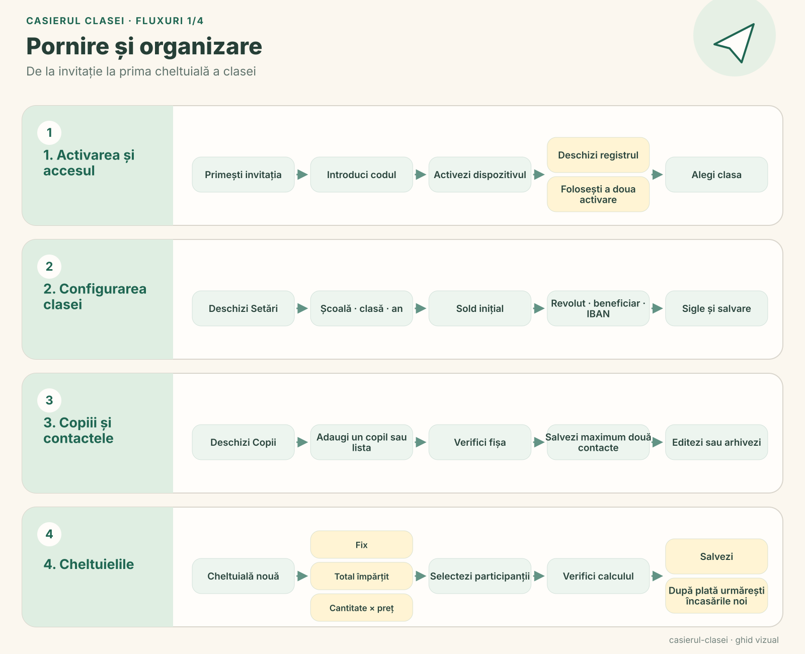
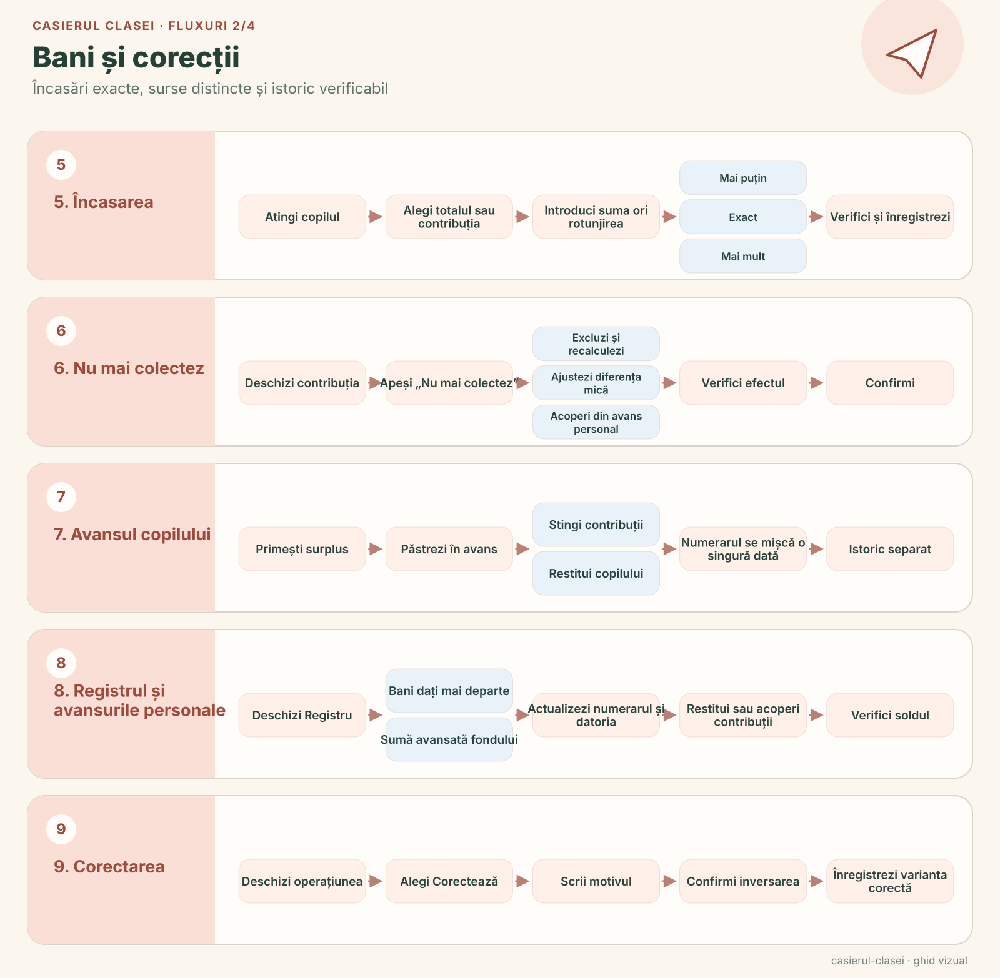
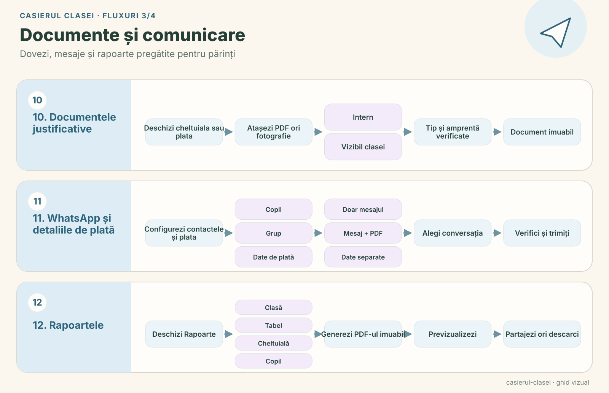
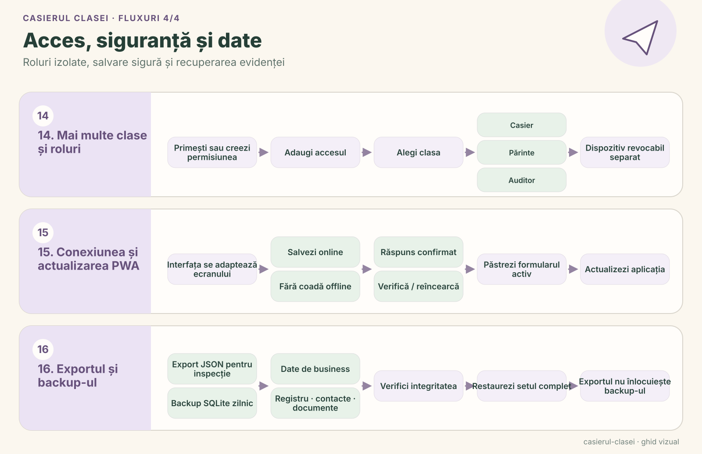

# Ghid vizual al fluxurilor

Acest ghid desenează toate fluxurile disponibile în aplicație. Textele și ordinea pașilor sunt aceleași cu ajutorul integrat accesibil prin semnul întrebării din antet. Pentru regulile și limitele fiecărei operațiuni, vezi și [inventarul fluxurilor implementate](current-flows.md).

Fiecare categorie are și o planșă SVG statică, potrivită pentru consultare directă, includere în alte documente sau imprimare. Fișierele sunt păstrate în [`docs/workflows`](workflows/README.md) și pot fi regenerate cu `node scripts/render-workflow-svg.mjs`.

## Pornire și organizare

```mermaid
flowchart TB
  subgraph A["Activarea și accesul"]
    direction LR
    A1[Primești invitația] --> A2[Introduci codul]
    A2 --> A3[Dispozitiv activat]
    A3 --> A4{Mai ai un dispozitiv?}
    A4 -- Da --> A5[Folosești a doua activare]
    A4 -- Nu --> A6[Deschizi registrul]
    A5 --> A6
    A6 --> A7{Mai multe clase?}
    A7 -- Da --> A8[Alegi clasa din antet]
  end

  subgraph B["Configurarea clasei"]
    direction LR
    B1[Deschizi Setări] --> B2[Școală · clasă · an]
    B2 --> B3[Sold inițial]
    B3 --> B4[Revolut · beneficiar · IBAN]
    B4 --> B5[Sigle]
    B5 --> B6[Salvezi]
  end

  subgraph C["Copiii și contactele"]
    direction LR
    C1[Deschizi Copii] --> C2[Adaugi unul sau lista]
    C2 --> C3[Verifici fișa]
    C3 --> C4[Adaugi maximum două contacte]
    C4 --> C5[Editezi sau arhivezi]
  end

  subgraph D["Cheltuielile"]
    direction LR
    D1[Cheltuială nouă] --> D2{Alegi calculul}
    D2 -->|Fix| D3[Sumă per copil]
    D2 -->|Împărțit| D4[Total împărțit exact]
    D2 -->|Cantitate| D5[Cantitate × preț]
    D3 --> D6[Selectezi participanții]
    D4 --> D6
    D5 --> D6
    D6 --> D7[Verifici previzualizarea]
    D7 --> D8[Salvezi]
  end
```

## Bani și corecții

```mermaid
flowchart TB
  subgraph E["Încasarea"]
    direction LR
    E1[Atingi copilul] --> E2[Alegi totalul sau contribuția]
    E2 --> E3[Introduci suma sau rotunjirea]
    E3 --> E4{Compari suma}
    E4 -- Mai puțin --> E5[Lași diferența sau o stingi explicit]
    E4 -- Exact --> E6[Contribuție stinsă]
    E4 -- Mai mult --> E7[Dai rest sau păstrezi avans]
    E5 --> E8[Verifici rezumatul]
    E6 --> E8
    E7 --> E8
    E8 --> E9[Înregistrezi]
  end

  subgraph F["Nu mai colectez"]
    direction LR
    F1[Contribuție neachitată] --> F2[Nu mai colectez]
    F2 --> F3{Situația reală}
    F3 -- Nu participă --> F4[Excluzi copilul]
    F4 --> F5[Recalculezi părțile celorlalți]
    F3 -- Rest de maximum 1 leu --> F9[Ajustezi rotunjirea]
    F9 --> F10[Păstrezi numerarul real]
    F3 -- Suma este acoperită --> F6[Alegi avansul personal și suma]
    F6 --> F7[Scade datoria clasei fără numerar nou]
    F5 --> F8[Verifici și confirmi]
    F10 --> F8
    F7 --> F8
  end

  subgraph G["Avansul copilului"]
    direction LR
    G1[Primești surplus] --> G2[Păstrez în avans]
    G2 --> G3{Ce faci ulterior?}
    G3 -- Folosești --> G4[Stingi contribuții fără numerar nou]
    G3 -- Restitui --> G5[Scazi avansul și numerarul]
    G4 --> G6[Istoric separat]
    G5 --> G6
  end

  subgraph H["Registrul și avansurile personale"]
    direction LR
    H1[Deschizi Registru] --> H2{Alegi operațiunea}
    H2 -- Plată --> H3[Bani dați mai departe]
    H2 -- Finanțare temporară --> H4[Sumă avansată fondului]
    H3 --> H5[Scade numerarul]
    H4 --> H6[Crește numerarul și datoria]
    H6 --> H7[Restitui sau acoperi contribuții]
  end

  subgraph I["Corectarea"]
    direction LR
    I1[Deschizi operațiunea] --> I2[Corectează]
    I2 --> I3[Scrii motivul]
    I3 --> I4[Confirmi inversarea]
    I4 --> I5[Înregistrezi varianta corectă]
  end
```

## Documente și comunicare

```mermaid
flowchart TB
  subgraph J["Documentele justificative"]
    direction LR
    J1[Deschizi cheltuiala sau plata] --> J2[Atașezi fișierul]
    J2 --> J3{Vizibilitate}
    J3 -- Intern --> J4[Casier și auditor]
    J3 -- Clasă --> J5[Și părinții autorizați]
    J4 --> J6[Tip și amprentă verificate]
    J5 --> J6
    J6 --> J7[Document imuabil]
  end

  subgraph K["WhatsApp și plata"]
    direction LR
    K1[Configurezi contacte și plata] --> K2{Ce trimiți?}
    K2 -- Copil --> K3[Mesaj privat precompletat]
    K3 --> K8{Doar text sau copie + PDF?}
    K2 -- Grup --> K4[Raport agregat și mesaj]
    K2 -- Date de plată --> K5[Revolut · beneficiar · IBAN separat]
    K8 --> K6[Alegi conversația]
    K4 --> K6
    K5 --> K6
    K6 --> K7[Verifici și apeși Trimite]
  end

  subgraph L["Rapoartele"]
    direction LR
    L1[Deschizi Rapoarte] --> L2{Alegi tipul}
    L2 --> L3[Situația clasei]
    L2 --> L4[Tabelul contribuțiilor]
    L2 --> L5[Cheltuială]
    L2 --> L6[Copil]
    L3 --> L7[Generezi instantaneul PDF]
    L4 --> L7
    L5 --> L7
    L6 --> L7
    L7 --> L8[Previzualizezi]
    L8 --> L9[Partajezi sau descarci]
    L9 --> L10[Emiți corecție dacă este nevoie]
  end
```

## Acces, siguranță și date

```mermaid
flowchart TB
  subgraph M["Mai multe clase și roluri"]
    direction LR
    M1[Primești sau creezi permisiunea] --> M2[Adaugi accesul]
    M2 --> M3[Alegi clasa]
    M3 --> M4{Rolul}
    M4 -- Casier --> M5[Consultă și modifică]
    M4 -- Părinte --> M6[Consultă propriul copil]
    M4 -- Auditor --> M7[Consultă registrul complet]
    M5 --> M8[Dispozitiv revocabil separat]
    M6 --> M8
    M7 --> M8
  end

  subgraph N["Conexiunea și actualizarea PWA"]
    direction LR
    N0[Deschizi pe telefon · tabletă · laptop] --> N1[Interfața folosește spațiul disponibil]
    N1 --> N2{Ai conexiune?}
    N2 -- Da --> N3[Salvezi online]
    N2 -- Nu --> N4[Nu se creează operațiuni offline]
    N3 --> N5{Răspuns pierdut?}
    N5 -- Da --> N6[Verifică / reîncearcă aceeași cerere]
    N5 -- Nu --> N7[Salvare confirmată]
    N6 --> N7
    N7 --> N8[Actualizarea PWA așteaptă formularele active]
  end

  subgraph O["Exportul și backup-ul"]
    direction LR
    O1[Casierul exportă JSON] --> O2[Date de business pentru inspecție]
    O3[Serviciul face backup zilnic] --> O4[SQLite cu registru · contacte · documente]
    O4 --> O5[Restaurare administrativă ghidată de procedură]
    O2 --> O6[Exportul nu înlocuiește backup-ul]
    O5 --> O6
  end
```

## Intrări contextuale în aplicație

| Ecran sau formular | Ajutor deschis direct |
| --- | --- |
| Activare | Activarea și cele două dispozitive |
| Setări | Configurarea clasei |
| Copii | Copiii, contactele și arhivarea |
| Fișa copilului | Încasarea și WhatsApp |
| Cheltuieli | Crearea, calculul și participanții |
| Nu mai colectez | Recalcularea sau acoperirea din fond disponibilă în acel moment |
| Avansul copilului | Folosirea și restituirea avansului |
| Registru | Plăți, avansuri personale și datorii |
| Documente | Tipul fișierului și vizibilitatea |
| Rapoarte | Emiterea, previzualizarea, partajarea și corecția |
